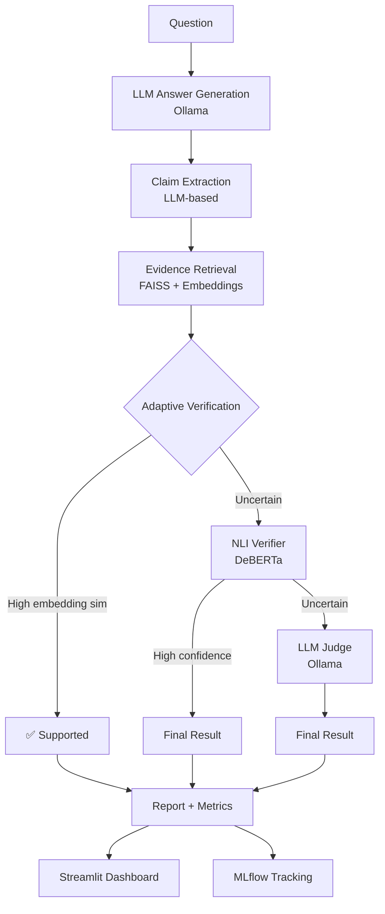

# 🛡️ HalluciGuard

> **Claim-Level LLM Hallucination Detection & Evaluation Framework**  
> A research prototype for detecting hallucinations at the individual claim level using adaptive cascading verification.

---

## 📌 Problem

Whole-answer hallucination detection treats a response as a single unit — either hallucinated or not. This is insufficient: an LLM answer may be **mostly factual with a single fabricated detail**, and binary detection misses this.

**HalluciGuard** verifies each extracted atomic claim independently against retrieved evidence, providing fine-grained hallucination analysis.

**Example:**

> *Question:* "Who founded Tesla?"  
> *Answer:* "Tesla was founded in 2003 by Elon Musk. Martin Eberhard served as early CEO."

| Claim | Status |
|---|---|
| Tesla was founded in 2003 | ✅ Supported |
| Elon Musk founded Tesla | ❌ Unsupported |
| Martin Eberhard served as early CEO | ✅ Supported |

---

## 🏗️ Architecture



---

## 🔬 Verification Methods

| Method | Description | Speed | Accuracy |
|---|---|---|---|
| **Embedding** | Cosine similarity between claim and evidence | ⚡ Fast | Baseline |
| **NLI** | DeBERTa entailment classification | ✅ Medium | Better |
| **LLM Judge** | Ollama LLM evaluates claim vs evidence | 🐢 Slow | Best |
| **Adaptive** *(proposed)* | Cascades: Embedding → NLI → LLM (only when needed) | ✅ Efficient | Competitive |

### Main Hypothesis

> A cascading verification architecture can **reduce expensive LLM calls** while maintaining competitive claim-level hallucination detection performance.

---

## 📁 Project Structure

```
HalluciGuard/
├── backend/
│   ├── main.py                    # FastAPI app
│   ├── config.py                  # Centralized config (pydantic-settings)
│   ├── api/routes.py              # REST endpoints
│   ├── services/
│   │   ├── answer_generator.py    # Ollama LLM
│   │   ├── claim_extractor.py     # LLM claim extraction
│   │   ├── retriever.py           # FAISS evidence retrieval
│   │   ├── similarity_verifier.py # Embedding baseline
│   │   ├── nli_verifier.py        # NLI baseline
│   │   ├── llm_verifier.py        # LLM judge baseline
│   │   ├── adaptive_verifier.py   # Proposed method
│   │   └── report_generator.py    # Metrics & report
│   ├── models/schemas.py          # Pydantic schemas
│   └── utils/logging_config.py
│
├── frontend/app.py                # Streamlit dashboard
│
├── data/
│   ├── documents/                 # Evidence corpus (.txt files)
│   └── evaluation/benchmark.json  # Ground-truth labeled claims
│
├── experiments/
│   ├── run_experiment.py          # CLI runner with MLflow
│   ├── baseline_embedding.py
│   ├── baseline_nli.py
│   ├── baseline_llm.py
│   └── adaptive_halluciguard.py
│
├── evaluation/
│   ├── metrics.py                 # Accuracy, F1, hallucination rate
│   ├── evaluator.py               # Run one method against benchmark
│   └── benchmark.py              # Compare all 4 methods
│
├── tests/                         # pytest unit tests
├── results/                       # Generated experiment CSVs
├── mlruns/                        # MLflow experiment data
├── requirements.txt
├── .env.example
└── run.py
```

---

## 🚀 Installation

### 1. Create virtual environment

```bash
python -m venv venv
```

**Windows:**
```bash
venv\Scripts\activate
```

**Linux/Mac:**
```bash
source venv/bin/activate
```

### 2. Install dependencies

```bash
pip install -r requirements.txt
```

### 3. Configure environment

```bash
cp .env.example .env
```

Edit `.env` as needed. Key settings:

```env
OLLAMA_BASE_URL=http://localhost:11434
OLLAMA_MODEL=qwen2.5:7b
EMBEDDING_MODEL=BAAI/bge-small-en-v1.5
TOP_K=5
```

---

## 🦙 Ollama Setup

1. **Install Ollama:** https://ollama.com/download

2. **Start Ollama:**
   ```bash
   ollama serve
   ```

3. **Pull the model:**
   ```bash
   ollama pull qwen2.5:7b
   ```

4. **Verify:**
   ```bash
   ollama list
   ```

> Any Ollama-compatible model works. Change `OLLAMA_MODEL` in `.env`.

---

## ▶️ Running the Application

### Backend (FastAPI)

```bash
uvicorn backend.main:app --reload --port 8000
```

Test health:
```bash
curl http://localhost:8000/health
```

### Frontend (Streamlit)

In a **separate terminal**:
```bash
streamlit run frontend/app.py
```

Open: http://localhost:8501

---

## 🧪 Running Experiments

```bash
# Single method
python experiments/run_experiment.py --method adaptive
python experiments/run_experiment.py --method embedding
python experiments/run_experiment.py --method nli
python experiments/run_experiment.py --method llm

# All methods (full comparison)
python experiments/run_experiment.py --method all
```

Results are saved to `results/` as CSV files.

---

## 📈 MLflow Tracking

### Launch MLflow UI

```bash
mlflow ui --port 5000
```

Open: http://localhost:5000

Each experiment run logs:
- **Parameters:** model, thresholds, method
- **Metrics:** accuracy, precision, recall, F1, faithfulness, hallucination rate, LLM avoidance rate
- **Artifacts:** result CSVs, confusion matrix JSON

---

## 🔌 API Endpoints

| Endpoint | Method | Description |
|---|---|---|
| `/health` | GET | Backend status check |
| `/analyze` | POST | Full pipeline analysis |
| `/retrieve` | POST | Evidence retrieval for a query |
| `/verify-claim` | POST | Verify a single claim against evidence |

### Example `/analyze` request:

```bash
curl -X POST http://localhost:8000/analyze \
  -H "Content-Type: application/json" \
  -d '{"question": "Who founded Tesla?", "verification_method": "adaptive"}'
```

---

## 🧪 Tests

```bash
pytest tests/ -v
```

Tests cover:
- Claim extraction (valid JSON, malformed, fallback)
- FAISS retrieval (indexing, relevance, structure)
- Similarity verifier (thresholds, empty evidence)
- API endpoints (/health, /retrieve, /verify-claim, /analyze validation)

---

## 📊 Evaluation Metrics

### Classification
- Accuracy, Precision, Recall, F1 (weighted)
- Per-class metrics (supported / uncertain / unsupported)
- Confusion matrix

### Hallucination (Project-specific)
- **Faithfulness Score** = Supported Claims / Total Claims
- **Hallucination Rate** = Unsupported Claims / Total Claims

### Efficiency (Adaptive method)
- LLM calls, NLI calls, Embedding calls
- **LLM Avoidance Rate** = 1 − (LLM calls / Total claims)
- Average latency per claim

---

## 🔬 Research Questions

1. Does claim-level verification improve hallucination detection over whole-answer approaches?
2. How do embedding, NLI, and LLM-based verification compare in accuracy?
3. Can adaptive verification reduce LLM calls while maintaining competitive accuracy?
4. What is the trade-off between verification accuracy and computational cost?

---

## ⚙️ Configuration Reference

| Variable | Default | Description |
|---|---|---|
| `OLLAMA_MODEL` | `qwen2.5:7b` | Ollama model name |
| `OLLAMA_BASE_URL` | `http://localhost:11434` | Ollama API URL |
| `EMBEDDING_MODEL` | `BAAI/bge-small-en-v1.5` | Sentence transformer model |
| `TOP_K` | `5` | Evidence chunks to retrieve |
| `SIMILARITY_THRESHOLD` | `0.70` | Embedding verification threshold |
| `HIGH_SIMILARITY_THRESHOLD` | `0.85` | Adaptive: skip NLI if above this |
| `LOW_SIMILARITY_THRESHOLD` | `0.40` | Adaptive: force NLI if below this |
| `NLI_CONFIDENCE_THRESHOLD` | `0.80` | Adaptive: call LLM if NLI below this |
| `NLI_MODEL` | `cross-encoder/nli-deberta-v3-small` | HuggingFace NLI model |
| `BACKEND_URL` | `http://localhost:8000` | Streamlit → Backend URL |
| `MLFLOW_TRACKING_URI` | `./mlruns` | MLflow tracking location |

---

## 📝 Adding Documents

Place `.txt` files in `data/documents/`. The system will:
1. Split into paragraphs (~chunks)
2. Embed with the configured sentence transformer
3. Index into FAISS

Delete `data/faiss_index/` to force a rebuild.

---

## ⚠️ Limitations

- Requires Ollama running locally for LLM-dependent features
- NLI and embedding models are downloaded on first run (~500MB)
- Small benchmark dataset (7 questions, ~33 claims) — extend `data/evaluation/benchmark.json` for robust research
- Adaptive thresholds are manually configured — future work could learn them

---

## 🏆 Acknowledgements

Built as a research internship project exploring claim-level hallucination detection using adaptive verification strategies.
